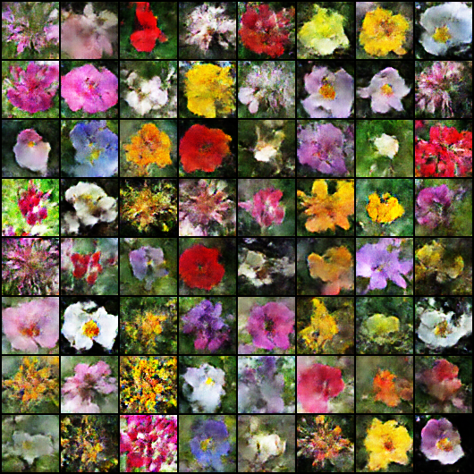

# DCGAN Flower Generator

This project implements a Deep Convolutional Generative Adversarial Network (DCGAN) to generate images of flowers using the [Flowers102](https://pytorch.org/vision/main/generated/torchvision.datasets.Flowers102.html) dataset.

## Project Structure
- `model.py`: Defines the Generator and Discriminator neural network architectures.
- `train.py`: Contains the training loop to train the GAN on the Flowers102 dataset.
- `generator.py`: A script to generate new flower images using a trained model checkpoint.

## Results
Here are some sample flowers generated by the model:



## Usage

### Prerequisites
- Python 3.x
- PyTorch
- Torchvision

### Training
To train the model, run:
```bash
python train.py
